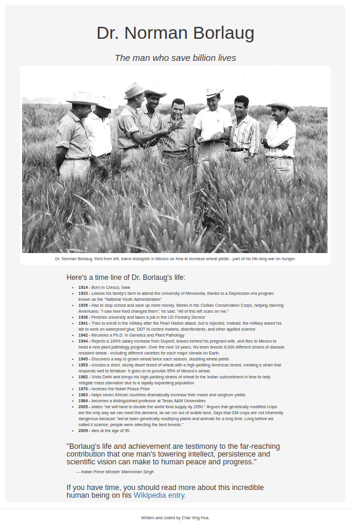

FreeCodeCamp Tribute Page
=========================
> This tribute page is for <a href="https://www.freecodecamp.com">FreeCodeCamp</a>'s basic front end development projects.  

***
Table Of Contents
=================
* [FreeCodeCamp Tribute Page](#freecodecamp-tribute-page)
* [Table Of Contents](#table-of-contents)
* [Highlight](#highlight)
  * [Software Resources](#software-resources)
  * [Screenshot](#screenshot)
* [About](#about)
  * [Contributor](#contributor)
  * [Status](#status)

*** 

Highlight
==========

Software Resources  
------------------
1. Window 10 Operating System  
2. IntelliJ PHPStorm Professional with Student License  
3. Git  
4. Bootstrap  
5. SourceTree  

Screenshot  
----------

  

***  

About
=====
Contributor
-----------
- **Chai Ying Hua** 

Status 
------
This tribute page had stop maintain and submitted to FreeCodeCamp. 

